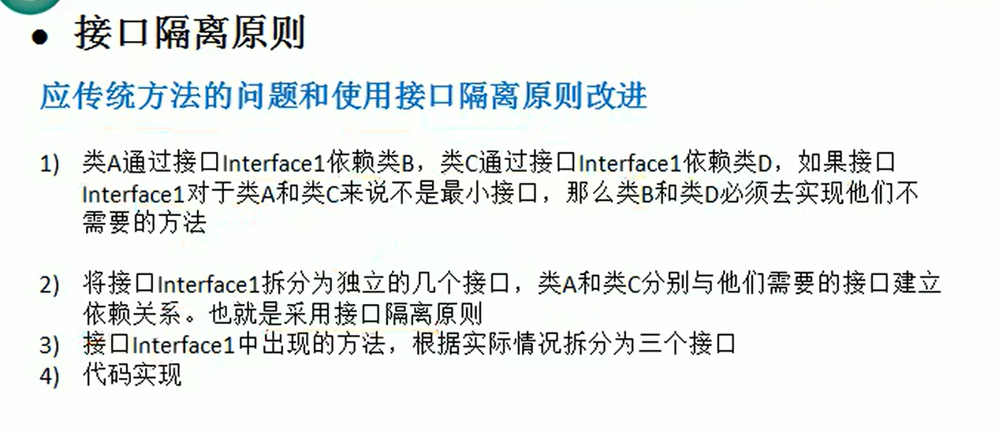

# Design Pattern ver.Java

## 序（看尚硅谷前几个视频）

### 后续得补一下UML类图具体知识】
目前看不懂这些箭头的意思 就懂dependency

### 深浅拷贝
浅拷贝：
深拷贝代码：后续传送到github

深拷贝的注意事项:

1.深拷贝会消耗更多资源，因为它需要创建新的对象和复制数据。

2.如果对象包含循环引用，深拷贝可能会导致内存溢出。

3.如果对象包含不可序列化的属性，使用序列化进行深拷贝会失败。

接下来思考怎么单独起一个Junit用于测试，并熟悉写单元测试代码，养成先写单元测试的习惯
（做完了） 写出了Junit5代码 找机会放github上。

### 设计模式面试题例题

原型模式 - spring中原型bean的创建？

设计模式七大原则？

例1

例2

例3

### 设计模式的目的

## 设计模式七大原则
### 单一职责原则

1. 降低类的复杂度，一个类只负责一个职责。降低引起的风险。
    （不然在改一个职责A1的时候可能同时耦合的职责A2会出错）
2. 提高类的可读性，可维护性
    （可读性：职责单一好读；可维护性：分块好改，但是如果分太细了改起来更麻烦）
3. 只有逻辑足够简单，才可以在代码级别违反单一职责原则；只有类中方法数量足够少，可以在方法级别保持单一原则（也是怕分的太细改起来太麻烦）

*感觉后续我要自己写一个关于此的深刻例子，只有自己写了感觉才掌握，而我之前的代码打都是屎山代码，估计很容易就code review到了*

### 接口隔离原则

1. *精髓就是* 一个类对另一个类的依赖应该建立在**最小**接口上

### 依赖倒转原则

依赖关系传递的三种方式：
1. 接口传递 （其实就是抽象成接口，然后接口依赖）
   
2. 构造方法传递 （其实就是加成员变量，成员变量依赖）
3. setter传递 （其实也是加成员变量，成员变量依赖，只不过用setter给成员赋值）
   

*精髓就是* 
1. 容易复杂的东西搞成抽象，然后去用合适的方式去依赖
2. 低层模块尽量都要有抽象类或接口，或者两者都有，程序稳定性更好。（毕竟低层一般代码多）
3. 变量的声明类型尽量是抽象类或接口（面向对象不是天天强调吗？），这样我们的变量引用和实际对象间，就存在一个缓冲层，利于程序扩展和优化。
4. 继承时遵循里氏替换原则

### 里氏替换原则

这个2）我真的没看懂

其实说的就是，不要重写父类已有的方法？？？（没人会这么做吧，想不到什么时候要这样）
如果非要重写，就让子类和父类去同时继承一个Base类

其实**组合？**关系就是说新建一个类A的成员变量a，然后去用a？？

放松一下眼睛 稍微健身一下 马上回来 14：53 休息到15：10分左右！！！！
暂时不敢看手机

### 开闭原则

（17年作为数学专业入职爬虫的我，被带我小哥哥指导了一下说不要往已有的代码上加代码，去新建类自己写，原来这叫开闭原则，他人特别好，除了这个也让我学到了很多东西）

*精髓* 模块和函数要对扩展开放，对修改关闭。 就是让写好的代码不要再改。

这一段代码不错（我自己写经常遇到这种问题），但我不截图了，忘了就回去看看视频吧。

